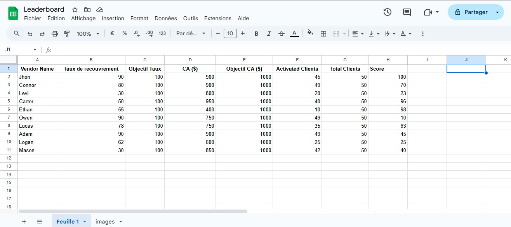

# 🏆 Live Leaderboard

A dynamic, real-time leaderboard designed to track sales team performance during competitions. Built for a custom corporate implementation to monitor sales metrics and rank participants.

*Live leaderboard interface showing top performers*

## ✨ Features

| Feature | Description |
|---------|-------------|
| 📊 **Real-time Updates** | Automatically refreshes data every 5 minutes |
| 🏅 **Top Performers Display** | Visual showcase of top 3 competitors with detailed metrics |
| 📋 **Complete Rankings** | Full list of all participants with their scores |
| 📱 **Responsive Design** | Works seamlessly on desktop, tablet, and mobile devices |
| 🖼️ **Dynamic Imagery** | Custom photos for each team member |
| 📈 **Performance Metrics** | Tracks three key performance indicators |

## 🚀 Live Demo

Experience the leaderboard in action: [Live Leaderboard Demo](https://bytescorpion.github.io/Live-Leaderboard/)

## 🛠️ Technology Stack

## 🗃️ Data Architecture

*Google Sheets backend structure*

The application uses Google Sheets as a database with two main components:

### Main Data Sheet
Tracks performance metrics with the following structure:
| Name | RecVal | RecTarget | CAVal | CATarget | ClientsVal | ClientsTarget | Score |
|------|--------|-----------|-------|----------|------------|---------------|-------|

### Images Sheet
Stores team member photos with URL references:
| Name | ImageURL |
|------|----------|

## 📊 Performance Metrics

The leaderboard tracks three key performance indicators:

1. **Recouvrement** - Recovery rate percentage
2. **CA** - Sales performance percentage
3. **Clients** - Client acquisition percentage

## 📝 License

This project was developed as a custom solution for company internal use. 

## 🤝 Support

For technical support or customization requests, please contact me

---

*This live leaderboard was created as a custom project for a company to monitor and display real-time performance during a sales competition, with the top performers earning a trip to Turkey.*
